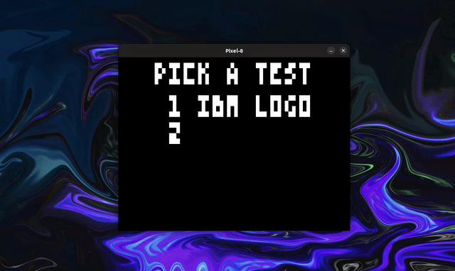

# Chip 8 Emulator



## Overview

This project is a Chip 8 emulator written in C. It faithfully emulates the Chip 8 architecture and allows you to play classic Chip 8 games.

## Getting Started

### Prerequisites

- A C compiler (e.g., GCC)
- CMake
- SDL2 library for handling graphics and input

### Building the Emulator

1. Clone the repository:
    ```sh
    git clone https://github.com/anthonygedeon/chip8.git
    cd chip8
    ```

2. Create a build directory and run CMake:
    ```sh
    mkdir build
    cd build
    cmake ..
    ```

3. Compile the emulator:
    ```sh
    make
    ```

### Running the Emulator

1. Place your Chip 8 ROMs in the `roms` directory.

2. Run the emulator with a ROM:
    ```sh
    ./chip8 roms/your-rom-file.ch8
    ```
3. Or run the test roms in the `test-roms` directory
    ```sh
    ./chip8 test-roms/chip8-test-suite.ch8
    ```

## Usage

- Use the arrow keys to navigate the menu.
- The keys 1-9 and A-F on your keyboard correspond to the Chip 8 keypad.

## Acknowledgements

- Thanks to all the Chip 8 community resources and documentation.
- Inspired by various Chip 8 emulator projects available online.

## Contributing

Feel free to submit pull requests or open issues if you find bugs or have suggestions for improvements.


### Support Me
Give a ⭐ if this project was helpful in any way!

## License

This project is licensed under the MIT License. See the [LICENSE](LICENSE) file for details.
